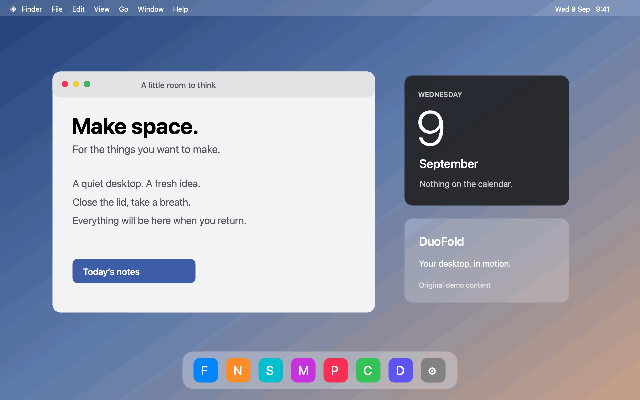

# DuoFold

A native macOS menu bar app that bends and progressively defocuses your live desktop as you close your MacBook. Built with Swift, AppKit, ScreenCaptureKit and Metal.



*Original sample desktop rendered by the shipping Metal shader. This is a simulated angle sweep, not a recording of a physical lid test.*

## Try it

Download the Apple silicon DMG from [Releases](https://github.com/lschvn/duofold/releases), drag DuoFold into Applications, and open it. Enable the effect and grant **Screen Recording** in System Settings when requested. The effect starts disabled. Escape pauses an active fold overlay; settings and Quit are in the menu bar.

This is an **experimental, ad-hoc signed preview**, without Apple notarization. macOS may block the downloaded app; use System Settings → Privacy & Security → Open Anyway if you choose to run it, or build from source. Do not disable Gatekeeper globally.

Requires macOS 14 or later, Apple silicon, and an accessible MacBook lid angle sensor. The synthetic preview works without a sensor or Screen Recording. The live effect targets the built-in display only. Protected video may appear blank.

## The effect

- Bottom-anchored perspective and a subtle curved surface.
- Spatial defocus: the free edge diffuses more than the hinge edge.
- Silk, Shade and Frost, with perspective, blur and shadow controls.
- Adjustable activation angle and continuous, critically damped movement on reversals.
- Live preview, manual angle, calibration and a five-second desktop demo.
- Optional opening sound and support for the system Reduce Motion preference.
- HID sensor events, with an explicitly reported 60 Hz feature-report fallback.

The app captures screen frames only while enabled, processes them on the Mac, and excludes its own windows from capture. It does not save or upload those frames. No account, network service, telemetry or Accessibility permission is used.

## Research and limits

[Read the animation research](docs/ANIMATION-RESEARCH.md) for timestamped Apple, Tech Chap, MKBHD and Numerama references, the visual breakdown, equations and uncertainties. [Validation status](docs/VALIDATION.md) distinguishes completed checks from physical testing still needed.

This is an independent adaptation inspired by the iPhone Duo transition. A MacBook has one visible display: it cannot reproduce the phone's two-display content handoff. The blur and perspective curves are inferred and tuned, not Apple's code or measured parameters. Visual parity and hardware-wide compatibility are not claimed. No affiliation with Apple or Bendy.

## Build

With Xcode command line tools installed:

```sh
swift test
./scripts/build-app.sh
open build/DuoFold.app
```

Create a DMG with `./scripts/package-dmg.sh`. The filename currently targets the Apple silicon release; the script builds for the host architecture.

Run production shader checks and generate the public demo without screen capture:

```sh
swift run DuoFold --self-test-render
swift run DuoFold --export-demo
swift run DuoFold --probe-sensor
```

`FoldCore` contains angle mapping, report validation and the spring. `Sources/DuoFold/Resources/Fold.metal` contains the surface and spatial blur shader. Reference footage is excluded from this repository; all demo pixels are an original synthetic fixture. The research links credit the original creators and sensor reference implementation.

MIT licensed. Contributions that include measured sensor traces, reproducible motion comparisons or hardware compatibility results are welcome.
